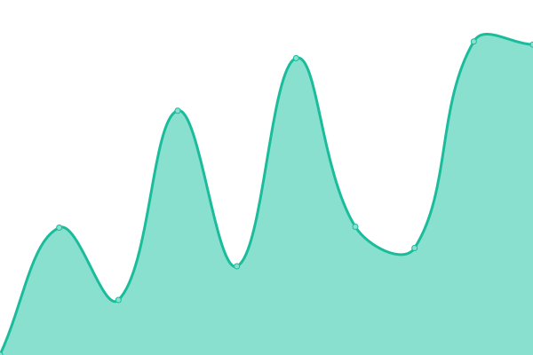
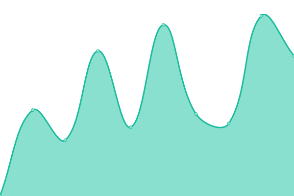
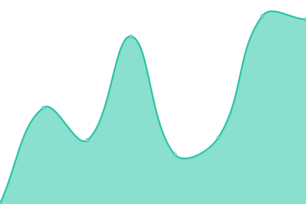

# [📈 Live Status](https://status.emre.xyz): <!--live status--> **🟧 Partial outage**

This repository contains the open-source uptime monitor and status page for [Upptime](https://upptime.js.org), powered by [Upptime](https://github.com/upptime/upptime).

With [Upptime](https://upptime.js.org), you can get your own unlimited and free uptime monitor and status page, powered entirely by a GitHub repository. We use [Issues](https://github.com/upptime/upptime/issues) as incident reports, [Actions](https://github.com/delirehberi/status/actions) as uptime monitors, and [Pages](https://status.emre.xyz) for the status page.

<!--start: status pages-->
<!-- This summary is generated by Upptime (https://github.com/upptime/upptime) -->
<!-- Do not edit this manually, your changes will be overwritten -->
<!-- prettier-ignore -->
| URL | Status | History | Response Time | Uptime |
| --- | ------ | ------- | ------------- | ------ |
|  [Emre.xyz](https://emre.xyz) | 🟩 Up | [emre-xyz.yml](https://github.com/delirehberi/status/commits/HEAD/history/emre-xyz.yml) | 

 69ms
     
 | 

<a href="https://status.emre.xyz/history/emre-xyz">100.00%</a>
    

|  [Bilimma](https://bilimma.com) | 🟥 Down | [bilimma.yml](https://github.com/delirehberi/status/commits/HEAD/history/bilimma.yml) | 

 52ms
     
 | 

<a href="https://status.emre.xyz/history/bilimma">11.35%</a>
    

|  [Eres](https://www.eresbiotech.com) | 🟩 Up | [eres.yml](https://github.com/delirehberi/status/commits/HEAD/history/eres.yml) | 

 917ms
     
 | 

<a href="https://status.emre.xyz/history/eres">89.92%</a>
    

|  [Tarihi Sanat](https://tarihisanat.com) | 🟥 Down | [tarihi-sanat.yml](https://github.com/delirehberi/status/commits/HEAD/history/tarihi-sanat.yml) | 

 0ms
     
 | 

<a href="https://status.emre.xyz/history/tarihi-sanat">0.00%</a>
    

|  [Ekog](https://ekog.org) | 🟥 Down | [ekog.yml](https://github.com/delirehberi/status/commits/HEAD/history/ekog.yml) | 

 0ms
     
 | 

<a href="https://status.emre.xyz/history/ekog">0.00%</a>
    

|  [Webend](https://webend.org) | 🟩 Up | [webend.yml](https://github.com/delirehberi/status/commits/HEAD/history/webend.yml) | 

 1381ms
     
 | 

<a href="https://status.emre.xyz/history/webend">99.16%</a>
    

|  [Hedef](https://hedef.im) | 🟥 Down | [hedef.yml](https://github.com/delirehberi/status/commits/HEAD/history/hedef.yml) | 

 0ms
     
 | 

<a href="https://status.emre.xyz/history/hedef">0.00%</a>
    

|  [acikbelediye](https://acikbelediye.com) | 🟥 Down | [acikbelediye.yml](https://github.com/delirehberi/status/commits/HEAD/history/acikbelediye.yml) | 

 0ms
     
 | 

<a href="https://status.emre.xyz/history/acikbelediye">0.00%</a>
    

|  [Workouse](https://workouse.com) | 🟥 Down | [workouse.yml](https://github.com/delirehberi/status/commits/HEAD/history/workouse.yml) | 

 0ms
     
 | 

<a href="https://status.emre.xyz/history/workouse">0.00%</a>
    

|  [Electrouse](https://electrouse.com) | 🟥 Down | [electrouse.yml](https://github.com/delirehberi/status/commits/HEAD/history/electrouse.yml) | 

 0ms
     
 | 

<a href="https://status.emre.xyz/history/electrouse">0.00%</a>
    

|  [Elcin Eksi](https://elcineksi.com) | 🟩 Up | [elcin-eksi.yml](https://github.com/delirehberi/status/commits/HEAD/history/elcin-eksi.yml) | 

 810ms
     
 | 

<a href="https://status.emre.xyz/history/elcin-eksi">88.93%</a>
    

|  [Arkeozooloji](https://arkeozooloji.com) | 🟥 Down | [arkeozooloji.yml](https://github.com/delirehberi/status/commits/HEAD/history/arkeozooloji.yml) | 

 0ms
     
 | 

<a href="https://status.emre.xyz/history/arkeozooloji">0.00%</a>
    

|  [Ankaranin Dogasi](https://ankaranindogasi.com) | 🟥 Down | [ankaranin-dogasi.yml](https://github.com/delirehberi/status/commits/HEAD/history/ankaranin-dogasi.yml) | 

 0ms
     
 | 

<a href="https://status.emre.xyz/history/ankaranin-dogasi">0.00%</a>
    

|  [History of art](https://historyofart.emre.xyz) | 🟥 Down | [history-of-art.yml](https://github.com/delirehberi/status/commits/HEAD/history/history-of-art.yml) | 

 0ms
     
 | 

<a href="https://status.emre.xyz/history/history-of-art">0.00%</a>
    

|  [Aydin Yazilimci Agi](https://aya.emre.xyz) | 🟥 Down | [aydin-yazilimci-agi.yml](https://github.com/delirehberi/status/commits/HEAD/history/aydin-yazilimci-agi.yml) | 

 0ms
     
 | 

<a href="https://status.emre.xyz/history/aydin-yazilimci-agi">0.00%</a>
    

|  [Certifly](https://getcertifly.com) | 🟩 Up | [certifly.yml](https://github.com/delirehberi/status/commits/HEAD/history/certifly.yml) | 

 408ms
     
 | 

<a href="https://status.emre.xyz/history/certifly">100.00%</a>
    

|  [Bioinformy](https://bioinformy.com) | 🟩 Up | [bioinformy.yml](https://github.com/delirehberi/status/commits/HEAD/history/bioinformy.yml) | 

 256ms
     
 | 

<a href="https://status.emre.xyz/history/bioinformy">100.00%</a>
    

|  [Bilim Kadinlari](https://bilimkadinlari.com) | 🟩 Up | [bilim-kadinlari.yml](https://github.com/delirehberi/status/commits/HEAD/history/bilim-kadinlari.yml) | 

 1049ms
     
 | 

<a href="https://status.emre.xyz/history/bilim-kadinlari">98.30%</a>
    

|  [Adu STT](https://adustt.com) | 🟥 Down | [adu-stt.yml](https://github.com/delirehberi/status/commits/HEAD/history/adu-stt.yml) | 

 0ms
     
 | 

<a href="https://status.emre.xyz/history/adu-stt">0.00%</a>
    

|  [Ses Seda](https://sesseda.org) | 🟩 Up | [ses-seda.yml](https://github.com/delirehberi/status/commits/HEAD/history/ses-seda.yml) | 

 781ms
     
 | 

<a href="https://status.emre.xyz/history/ses-seda">100.00%</a>
    

<!--end: status pages-->

[**Visit our status website →**](https://status.emre.xyz)

## 📄 License

- Powered by: [Upptime](https://github.com/upptime/upptime)
- Code: [MIT](./LICENSE) © [Upptime](https://upptime.js.org)
- Data in the `./history` directory: [Open Database License](https://opendatacommons.org/licenses/odbl/1-0/)
