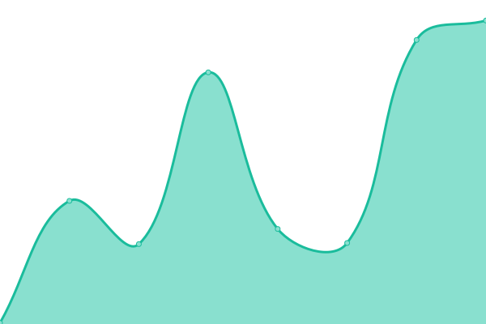

# [📈 Live Status](https://status.emre.xyz): <!--live status--> **🟧 Partial outage**

This repository contains the open-source uptime monitor and status page for [Upptime](https://upptime.js.org), powered by [Upptime](https://github.com/upptime/upptime).

With [Upptime](https://upptime.js.org), you can get your own unlimited and free uptime monitor and status page, powered entirely by a GitHub repository. We use [Issues](https://github.com/upptime/upptime/issues) as incident reports, [Actions](https://github.com/delirehberi/status/actions) as uptime monitors, and [Pages](https://status.emre.xyz) for the status page.

<!--start: status pages-->
<!-- This summary is generated by Upptime (https://github.com/upptime/upptime) -->
<!-- Do not edit this manually, your changes will be overwritten -->
<!-- prettier-ignore -->
| URL | Status | History | Response Time | Uptime |
| --- | ------ | ------- | ------------- | ------ |
|  [Emre.xyz](https://emre.xyz) | 🟥 Down | [emre-xyz.yml](https://github.com/delirehberi/status/commits/HEAD/history/emre-xyz.yml) | 

 733ms
     
 | 

<a href="https://status.emre.xyz/history/emre-xyz">99.43%</a>
    

|  [Bilimma](https://bilimma.com) | 🟩 Up | [bilimma.yml](https://github.com/delirehberi/status/commits/HEAD/history/bilimma.yml) | 

 3401ms
     
 | 

<a href="https://status.emre.xyz/history/bilimma">99.45%</a>
    

|  [Eres](https://www.eresbiotech.com) | 🟩 Up | [eres.yml](https://github.com/delirehberi/status/commits/HEAD/history/eres.yml) | 

 1411ms
     
 | 

<a href="https://status.emre.xyz/history/eres">99.26%</a>
    

|  [Tarihi Sanat](https://tarihisanat.com) | 🟩 Up | [tarihi-sanat.yml](https://github.com/delirehberi/status/commits/HEAD/history/tarihi-sanat.yml) | 

 1018ms
     
 | 

<a href="https://status.emre.xyz/history/tarihi-sanat">99.46%</a>
    

|  [Ekog](https://ekog.org) | 🟩 Up | [ekog.yml](https://github.com/delirehberi/status/commits/HEAD/history/ekog.yml) | 

 1576ms
     
 | 

<a href="https://status.emre.xyz/history/ekog">99.46%</a>
    

|  [Webend](https://webend.org) | 🟩 Up | [webend.yml](https://github.com/delirehberi/status/commits/HEAD/history/webend.yml) | 

 169ms
     
 | 

<a href="https://status.emre.xyz/history/webend">100.00%</a>
    

|  [Hedef](https://hedef.im) | 🟩 Up | [hedef.yml](https://github.com/delirehberi/status/commits/HEAD/history/hedef.yml) | 

 549ms
     
 | 

<a href="https://status.emre.xyz/history/hedef">99.47%</a>
    

<!--end: status pages-->

[**Visit our status website →**](https://status.emre.xyz)

## 📄 License

- Powered by: [Upptime](https://github.com/upptime/upptime)
- Code: [MIT](./LICENSE) © [Upptime](https://upptime.js.org)
- Data in the `./history` directory: [Open Database License](https://opendatacommons.org/licenses/odbl/1-0/)
